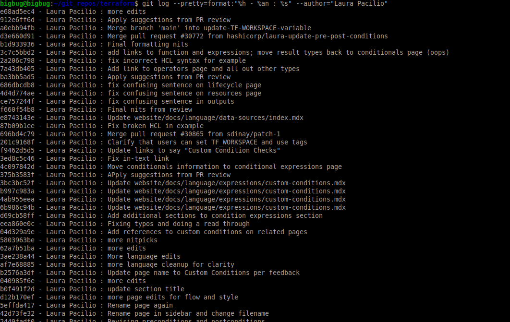
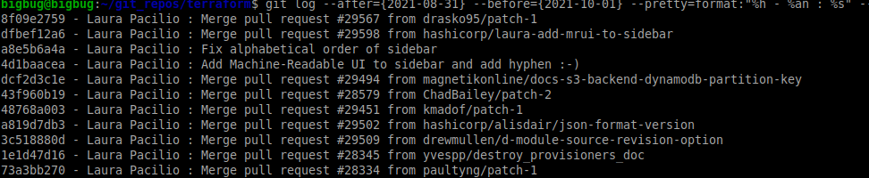
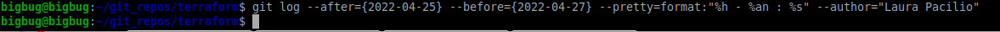

# DevOps otrais majasdarbs
## by _Romans Heimanis_

### GIT neredz starpības starp vienadiem failiem, HASH ir vienads, diff nerada starpības.


### GIT izmaiņas terraform pagajušā nedeļā


un otrais variants - izsaukt
```sh
git log
```
un sameklet sarakstā

trešais variants - caur github web.

### GIT saraksts ar izmaiņam terraform kurus veica “Laura Pacilio”


### GIT saraksts ar izmaiņam terraform kurus veica “Laura Pacilio” pagajušgad septembrī


### GIT saraksts ar izmaiņam terraform kurus veica “Laura Pacilio” vakardien (neveica)


### GIT saraksts ar izmaiņam terraform 2021 20-21 aprili, kas dateti ar 16. aprili
![punkts *](punkts_star.png]

Tas varetu notikt deļ ta ka autorā datorā bija nepareizais datums
